# Cloudflared
This version runs Vaultwarden and a small IoT stack for humidity and temperature monitoring and it is accessible by just the domain utilizing Cloudflare Tunnel.  
Since my lovely ISP blocks me from obtaining an SSL certificate and also blocks any incoming traffic, this is the best option I've found to expose my services so as to not rely on Tailscale or any other VPNs.  
>[!NOTE]
>In the first version it was running on Debian which I switched out to Alma Linux to utilize the benefits of SELinux. Which of course comes with a bunch of new challanges but I'm putting them into the guide as well.  

## Repo structure
```
/
├── README.md
├── compose.yml
├── Caddyfile
├── mosquitto.conf
├── telegraf.conf
└── images/
    └── ...
```
## What you need
- a valid domain name you own
- a Cloudflare account
- a data source for the IoT stack to record

## Configuration
>[!NOTE]
>From now on, this guide assumes your destination directory is /compose. If you wish to place it elsewhere, feel free to change the paths.
>Also, from my own fault I randomly put sudo in front of some commands and miss it from other places. So be ware you might need more sudo's than I wrote here.
### Add your domain to your Cloudflare account
On https://dash.cloudflare.com/ navigate to Domains and either press "Buy a domain" if you don't have one and want to buy it from Cloudflare or continue with "Onboard a domain".  
Enter your apex domain and press Continue at the bottom.  
Update the nameservers at your registar  
For me, I logged in to namecheap, navigated to Account > Domains > Manage:  
  
Then I updated the nameservers with the ones Cloudflare provided:  
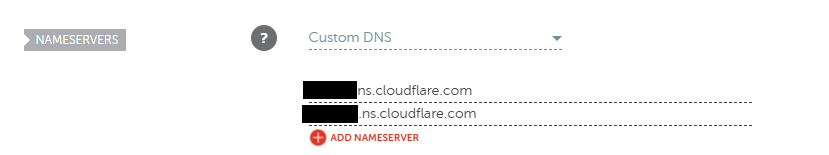  
  
> [!NOTE]
> Note: This section may not be fully accurate as I've written this from memory as I've not started the documentation until it worked, and this section can't be backtracked as it's GUI heavy. Refer to the official guides if my explanation misses parts https://developers.cloudflare.com/fundamentals/manage-domains/add-site/

###  Create the Cloudflare Tunnel
On https://dash.cloudflare.com/ navigate to Zero Trust > Networks > Connectors.  
Here, under Cloudflare Tunnels press Create a tunnel and choose Cloudflared then press Next.  
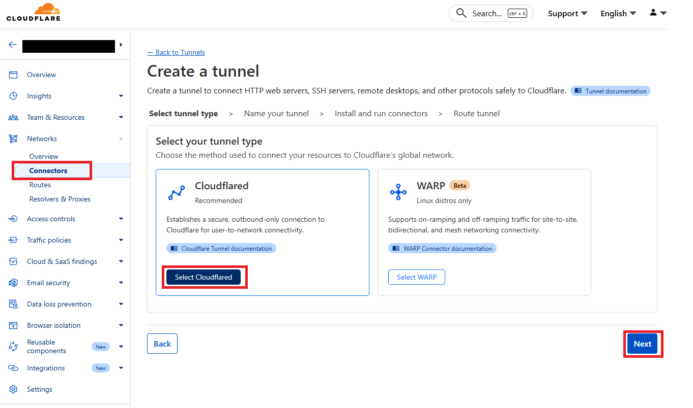  
Enter a recognizable name, then continue.  
Choose your environtment and follow the instructions.   
> [!TIP]
> I've included both Debian and Red Hat (or Alma) configartions, if your environment is one of them, follow the correct one, if not, follow the instructions given to you by Cloudflare when selecting your environment.   

**Alma:**  
```
curl -fsSl https://pkg.cloudflare.com/cloudflared.repo | sudo tee /etc/yum.repos.d/cloudflared.repo

sudo yum update
sudo yum install cloudflared

sudo cloudflared service install {token}
```
**Debian:**  
```
sudo mkdir -p --mode=0755 /usr/share/keyrings
curl -fsSL https://pkg.cloudflare.com/cloudflare-public-v2.gpg | sudo tee /usr/share/keyrings/cloudflare-public-v2.gpg >/dev/null

echo 'deb [signed-by=/usr/share/keyrings/cloudflare-public-v2.gpg] https://pkg.cloudflare.com/cloudflared any main' | sudo tee /etc/apt/sources.list.d/cloudflared.list

sudo apt-get update && sudo apt-get install cloudflared
sudo cloudflared service install {token}
```

After doing that, click Configure on your newly created tunnel  
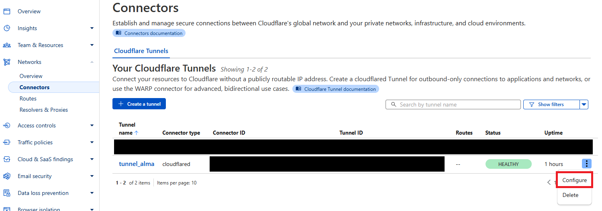  
Click Add a published application route (you can add more later)  
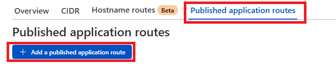  
Configure your application route  
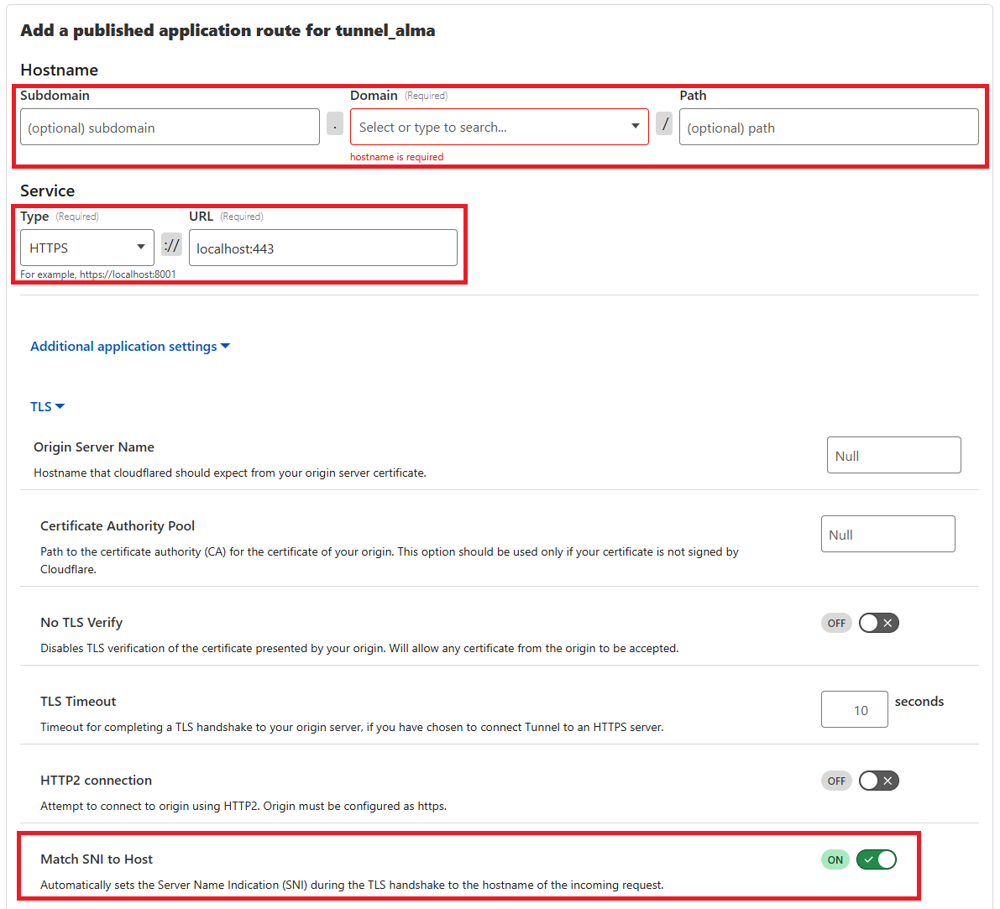  

>[!IMPORTANT]
>If you want Caddy to handle TLS and not Cloudflare, then under the 'Service' select HTTPS for 'Type' and type localhost:443 for the 'URL' (or where Caddy is listening).  
>Expand Additional application settings > TLS and toggle 'Match SNI to Host' ON.  

After finishing, you can repeat this process to add more routes. (press the three dots > Configure > Published application routes to add more routes, for example for different services under separate subdomains.)  

### Getting Podman Compose
>[!NOTE]
>If you're on Debian or any other system that has no SELinux integration, you can safely go with Docker Compose.

Since we are on Alma Linux our containers need to be able to cooperate with SELinux without any problems (and I've found Docker has issues with exactly that, and I've left out getting Docker in the previous version anyways).  
To get Podman Compose use the following commands:
```
sudo dnf install -y epel-release
sudo dnf install -y podman-compose
```
I believe that's all that is needed to be done.
To be sure it works, run ```podman compose --version```. If it prints a version number, you're good to go.

#### Docker/Podman common commands  
To start the containers use `podman compose up -d`  
To start one container use `podman start container`  
To stop one container use `podman stop container`  
To restart one container use `podman restart container`  
To stop all containers use `podman compose down`  

### Creating a Cloudflare API token for Caddy
For this I followed the [original guide](https://github.com/CaddyBuilds/caddy-cloudflare?tab=readme-ov-file#configuration) step by step, but here's what I did:  
Navigate to Profile > API Tokens and click Create Token:   
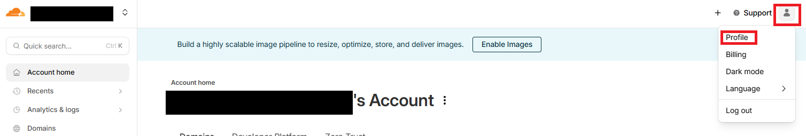  
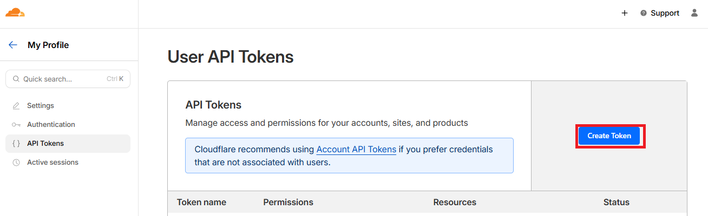  
Then click Get started and configure it the following way:  
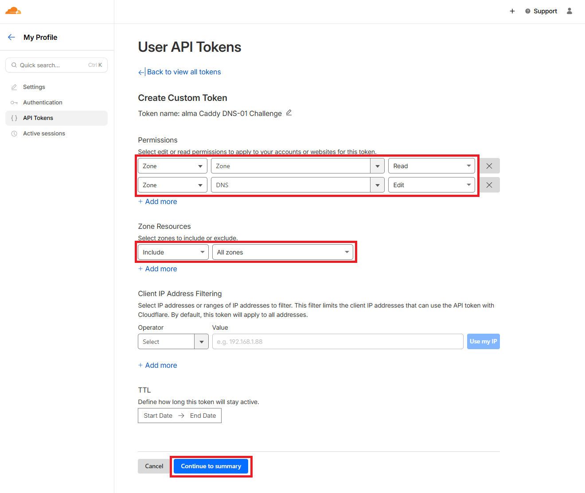  
Then Click Continue to summary, and create it and SAVE THE TOKEN.
>[!WARNING]
>NEVER share your API token with anyone.  
>Save your API key somewhere secure, because you'll need it in the following step and you can't open it again.
  
### Create/update the Compose file
Here's the link to the [original guide](https://github.com/CaddyBuilds/caddy-cloudflare).
>[!IMPORTANT]
>Replace the CLOUDFLARE_API_TOKEN value to the token you got in the previous step.

To create the file use ```vim /compose/compose.yml``` and paste in the following block which adds Caddy into:
```
services:
  caddy:
    image: ghcr.io/caddybuilds/caddy-cloudflare:latest
    container_name: caddy
    restart: unless-stopped
    cap_add:
      - NET_ADMIN
    ports:
      - "80:80"
      - "443:443"
      - "443:443/udp"
    volumes:
      - ./Caddyfile:/etc/caddy/Caddyfile:Z,ro
      - caddy_data:/data:Z
      - caddy_config:/config:Z
    environment:
      - CLOUDFLARE_API_TOKEN=my_not_public_token
    networks:
      - my-network

networks:
  my-network:
    driver: bridge

volumes:
  caddy_data:
  caddy_config:
```

### Create/update the Caddyfile
Create it with ```vim /compose/Caddyfile```   
I used the Global Configuration setup and it looks like this:
```
{
	acme_dns cloudflare {env.CLOUDFLARE_API_TOKEN}
}

subdomain.example.tld {
	reverse_proxy vaultwarden:1111
}
```
Afterwards, change permissions with ```chmod 400 /compose/Caddyfile```

### Add Vaultwarden as a service
First of all, make the directory where you want it to store the data with ```sudo mkdir /compose/vaultwarden-data/```   
You have to append the next section to the already created compose.yml in a way that vaultwarden is one intendation (2 spaces in my versions) inside the big "services:" block.
```
  vaultwarden:
    image: vaultwarden/server:latest
    container_name: vaultwarden
    restart: unless-stopped
    user: "65534:65534"
    volumes:
      - ./vaultwarden-data:/data:Z
    environment:
      ROCKET_PORT: 1111
      ROCKET_ADDRESS: 0.0.0.0
    networks:
      - my-network
```
Since we told the container to run as non-root inside itself, we have to update the file and directory permissions on the host as well.
```
sudo chown -R 65534:65534 /compose/vaultwarden-data/
sudo chmod -R 700 /compose/vaultwarden-data/
```

### Firewall
>[!IMPORTANT]
>Alma uses Firewalld by default, but on other systems (Ubuntu/Debian) you might encounter other firewalls, but you have to enable port 443 over TCP in all cases.  

To allow Caddy to listen and actually send and recieve traffic on port 443 (HTTPS) use the following commands:
```
firewall-cmd --zone=public --add-port=443/tcp --permanent
firewall-cmd --reload
firewall-cdm --list-ports
```
The last command should return `443/tcp`.

### Add the IoT monitoring stack
#### Update compose.yml
To include the necessary services, update the pre-existing `compose.yml`
```
services:
  mosquitto:
    image: eclipse-mosquitto:latest
    container_name: mosquitto
    restart: unless-stopped
    volumes:
      - ./mosquitto/mosquitto.conf:/mosquitto/config/mosquitto.conf:Z
      - ./mosquitto/data:/mosquitto/data:Z
      - ./mosquitto/log:/mosquitto/log:Z
    ports:
      - "1883:1883"
    networks:
      - my-network

  influxdb:
    image: influxdb:latest
    container_name: influxdb
    restart: unless-stopped
    volumes:
      - ./influx_data:/var/lib/influxdb:Z
    environment:
      DOCKER_INFLUXDB_INIT_MODE: setup
      DOCKER_INFLUXDB_INIT_USERNAME: admin
      DOCKER_INFLUXDB_INIT_PASSWORD: admin_password
      DOCKER_INFLUXDB_INIT_ORG: myorg
      DOCKER_INFLUXDB_INIT_BUCKET: sensors
      DOCKER_INFLUXDB_INIT_RETENTION: 30d
    networks:
      - my-network

  grafana:
    image: grafana/grafana:latest
    container_name: grafana
    restart: unless-stopped
    volumes:
      - grafana_data:/var/lib/grafana
    networks:
      - my-network

  telegraf:
    image: telegraf:latest
    container_name: telegraf
    restart: unless-stopped
    user: root
    init: false
    entrypoint: ["/usr/bin/telegraf"]
    depends_on:
      - influxdb
      - mosquitto
    volumes:
      - ./telegraf/telegraf.conf:/etc/telegraf/telegraf.conf:Z,ro
    networks:
      - my-network

volumes:
  grafana_data:
```

#### Update the Caddyfile
To include the reverse proxying for the new services, update the pre-existing `Caddyfile`
```
grafana.example.tld {
	reverse_proxy grafana:3000
}

influx.example.tld {
	reverse_proxy influxdb:8086
}
```

#### Mosquitto
Create the necessary directories and the configuration file:
```
mkdir /compose/mosquitto
mkdir /compose/mosquitto/data
mkdir /compose/mosquitto/logs
vim /compose/mosquitto/mosquitto.conf
```
Add the following content into `mosquitto.conf`
```
listener 1883
protocol mqtt

allow_anonymous true
```
This will make it listen on port 1883 and removes the need for passwords and usernames to upload data.  
Next, update the firewall to allow traffic over port 1883:
```
firewall-cmd --add-port=1883/tcp --permanent
firewall-cmd --reload
```
Test it with `firewall-cmd --list-ports`. You should see it list 1883/tcp.  
You can test whether Mosquitto works by opening two terminals and pasting one of the following two commands into each:
```
podman exec -it mosquitto mosquitto_sub -h localhost -p 1883 -t test
```
```
podman exec -it mosquitto mosquitto_pub -h localhost -p 1883 -t test -m "hello"
```
If `hello` appears in the terminal where you pasted the first command, then the service itself is working.  
To check the firewall, you have to send data to it from another device (like an ESP32) and use the first command to see whether it's arriving or not.

#### InfluxDB
First, create your dir that the service will use and change the ownership and permissions.
>[!NOTE]
>Replace [your user] and [your group] with your user accounts username and primary group name.

```
mkdir /compose/influx_data
chown [your user]:[your group] /compose/influx_data
chmod 700 /compose/influx_data
```
>[!WARNING]
>You have to `podman compose up -d` to start the services and can use `podman exec -it grafana curl -I http://influxdb:8086/health` and `podman exec -it influxdb curl -I http://grafana:3000/health` to check whether they started ok.  
>Outputs for both should start with HTTP/1.1 200 OK  

Open your InfluxDB admin panel at influx.example.tld (after starting your compose stack of course) and log in.
Then, navigate to Load Data > Buckets > Create Bucket, and create a bucket with your desired name and retention period.  
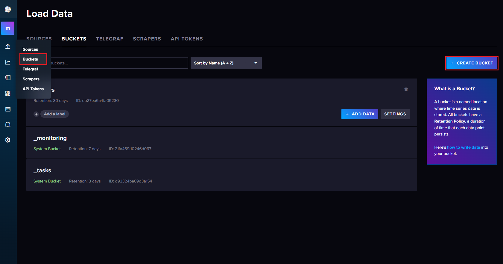  
Next, go to Load Data > API Tokens > Generate API Token > All Access API Token, and create two tokens. One for Grafana, one for Telegraf.
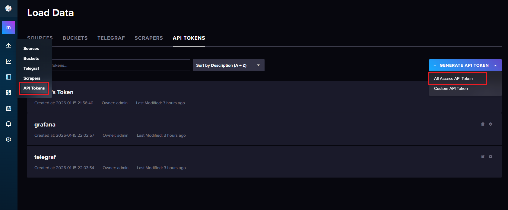  
>[!WARNING]
>Save your API Tokens as you will not be able to view them anymore.
>AND NEVER SHARE THEM.


#### Grafana
Open your Grafana admin panel at grafana.example.tld (after starting your compose stack of course) and log in.  
Navigate to Connections > Add new connection and search for InfluxDB. 
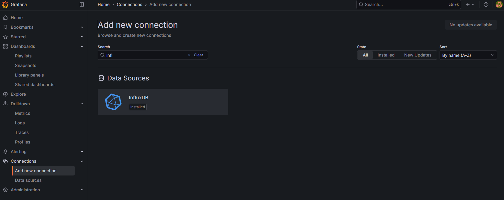  
Click on it and click Add new data source.  
Change the Query language to Flux, set the HTTP URL to http://influxdb:8086, turn off all Auth and fill in the InfluxDB Details according to your own configurations.
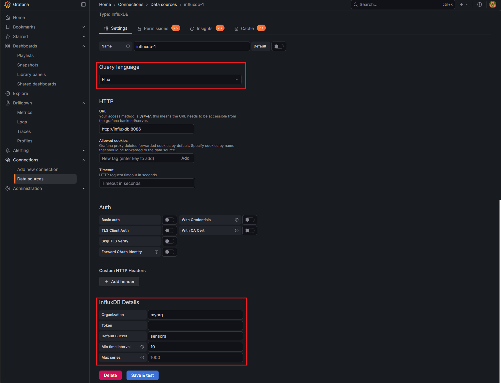  
Click Save & test. If it says `datasource is working. x buckets found`, you're good to go.  
Finally, go to Dashboards, click New > New dashboard, then Add visualization.  
Select the default influxdb and paste a query you'd like to be displayed.  
For me the two I have are the realtime humidity data and a per minute average of it.
```
from(bucket: "sensors")
  |> range(start: -5m)

```
```
from(bucket: "sensors")
  |> range(start: -5h)
  |> filter(fn: (r) => r._measurement == "mqtt_consumer")
  |> filter(fn: (r) => r._field == "value")
  |> aggregateWindow(every: 1m, fn: mean)
```
#### Telegraf
Create the necessary directories and the configuration file:
```
mkdir /compose/telegraf
vim /compose/telegraf/telegraf.conf
```
Now, add the next snippet into `telegraf.conf`
```
[agent]
  interval = "1s"
  round_interval = true

[[inputs.mqtt_consumer]]
  servers = ["tcp://mosquitto:1883"]
  topics = ["sensors/#"]
  qos = 0
  connection_timeout = "30"
  data_format = "value"
  data_type = "float"

[[outputs.influxdb_v2]]
  urls = ["http://influxdb:8086"]
  token = "{token}"
  organization = "myorg"
  bucket = "sensors"
```
>[!IMPORTANT]
>Replace {token} with your API Token you generated in InfluxDB for Telegraf.  
>After creating the configuration file, use `podman restart telegraf` for it to take effect.

### SELinux contexts
>[!NOTE]
>In the previous version of the project, I manually set the context to svirt_sandbox_file_t. It did work, but with the side effect of all containers being able to access each others files and directories.

You can manage SELinux contexts by simply adding a :Z at the end of each mount in the compose.yml. This creates private labels so each container only has access to its files or directories.  
You can check with the `ls -Z {file/dir}` command to see if it works, and should see something similar to system_u:object_r:container_file_t:s0:c134,c834 {file/dir}

### Debug
I didn't run into any issues but if you do, please reference the original guide and also you can view logs with:  
`podman logs <container-name>`

### Backups for Vaultwarden
Creating the backup:
```
rsync -a --no-xattrs /compose/vaultwarden-data/ /tmp/vaultwarden-data-bak && 7z a -p"password" vaultwarden-backup.7z /tmp/vaultwarden-data-bak && rm -rf /tmp/vaultwarden-data-bak
```
Restoring the backup:
>[!WARNING]
>These commands erase your old directory's data, so only use it if that is unsaveable. Or just use the extract part if you want to.

```
# Extract
7z x vaultwarden-backup.7z -ppassword -o/compose/vaultwarden-restore
# Replace your old directory's data
cp -R /compose/vaultwarden-restore /compose/vaultwarden-data && rm -rf /compose/vaultwarden-restore && chown -R nobody:nobody /compose/vaultwarden-data
```
## Results
If everything went according to plan, your domain (and/or subdomains) should be reachable from just a web browser.
Now, I can access my own Vaultwarden service just by typing in the subdomain for it, as well as viewing my relative humidity from anywhere in the world.  
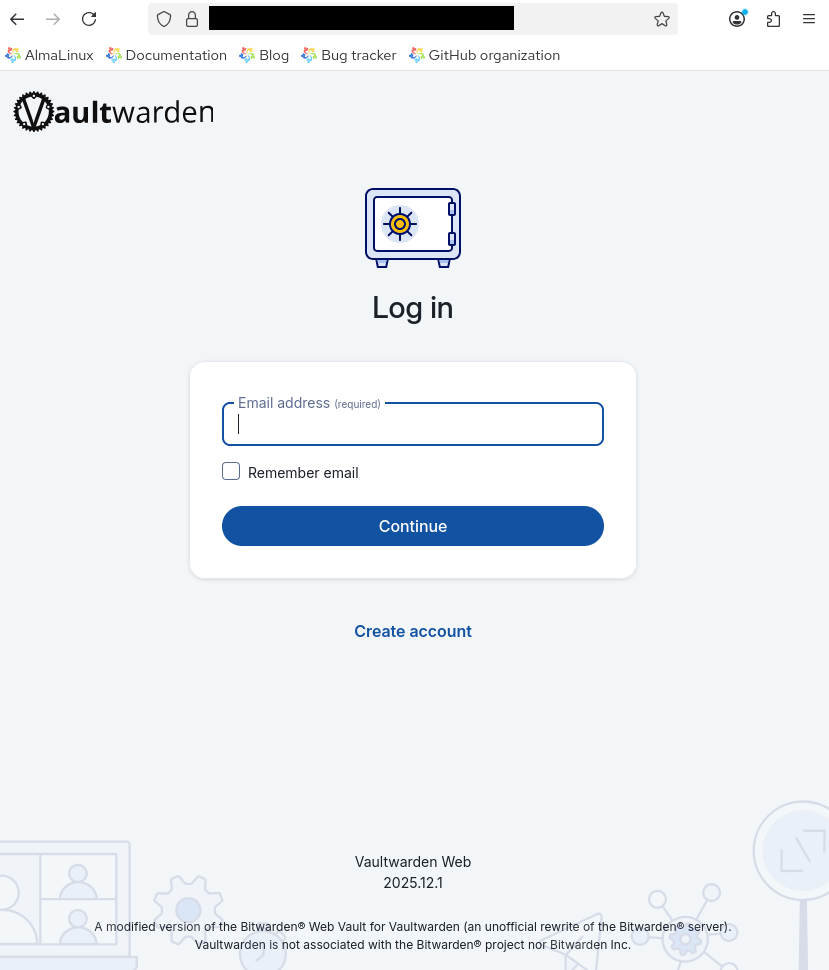  
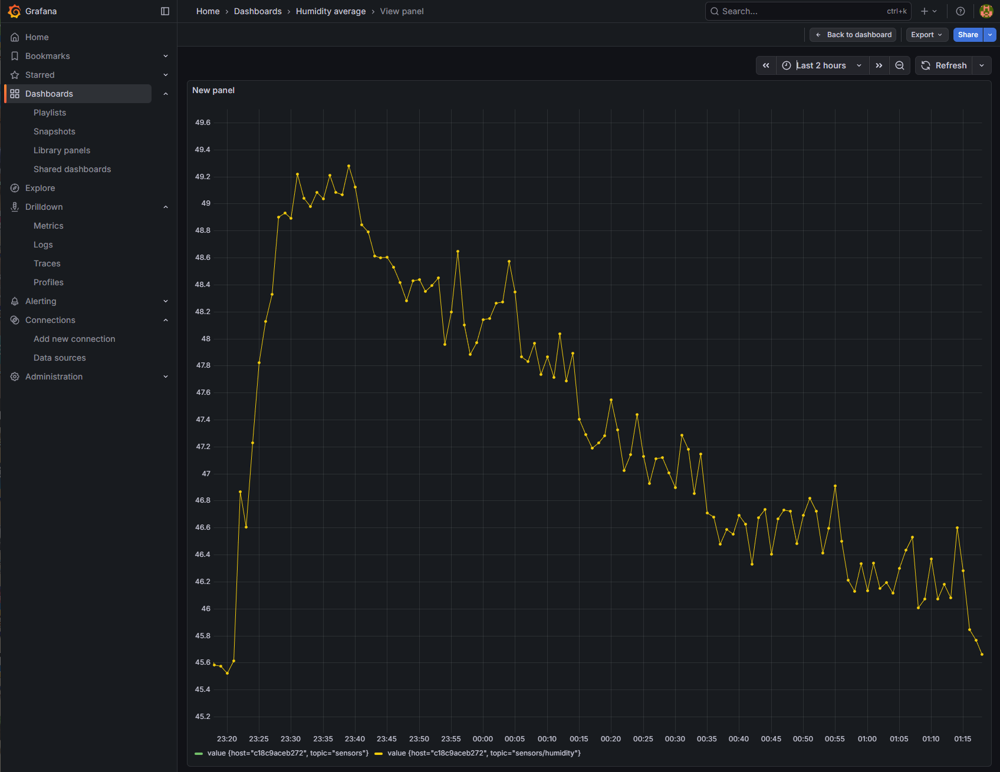  