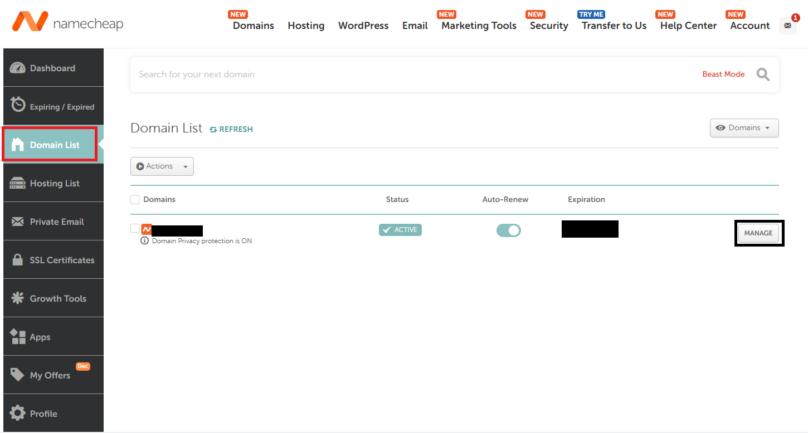
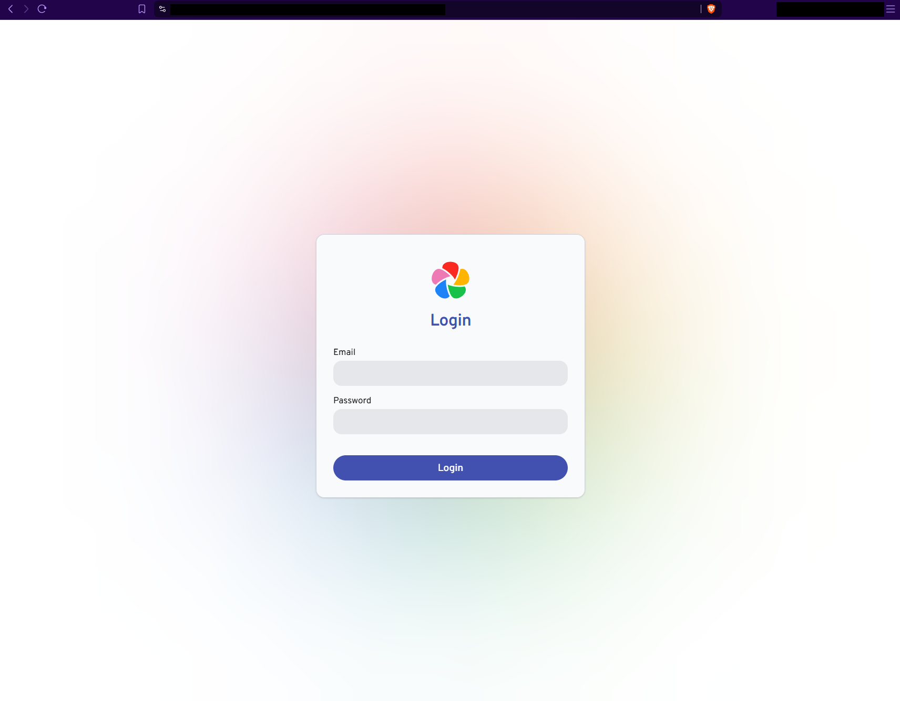

# Cloudflared
This version runs the same services as the Tailscale one but it is accessible by just the domain utilizing Cloudflare Tunnel.  
Since my lovely ISP blocks me from obtaining an SSL certificate and also blocks any incoming traffic, this is the best option I've found to expose my services so as to not rely on Tailscale or any other VPNs.  

## Repo structure
```
/
├── README.md
├── docker-compose.yml
├── Caddyfile
├── images/
    ├── 1.png
    └── 2.png
```
## What you need
- a valid domain name you own
- a Cloudflare account

## Configuration
### Add your domain to your Cloudflare account
On https://dash.cloudflare.com/ navigate to Domains and either press "Buy a domain" if you don't have one and want to buy it from Cloudflare or continue with "Onboard a domain".  
Enter your apex domain and press Continue at the bottom.  
Update the nameservers at your registar  
For me, I logged in to namecheap, navigated to Account > Domains > Manage:  
  
Then I updated the nameservers with the ones Cloudflare provided:  
  
  
> [!NOTE]
> Note: This section may not be fully accurate as I've written this from memory as I've not started the documentation until it worked, and this section can't be backtracked as it's GUI heavy. Refer to the official guides if my explanation was lacking https://developers.cloudflare.com/fundamentals/manage-domains/add-site/

###  Create the Cloudflare Tunnel
On https://dash.cloudflare.com/ navigate to Zero Trust > Networks > Connectors.  
Here, under Cloudflare Tunnels press Create a tunnel and choose Cloudflared.  
Enter a recognizable name, then continue.  
Choose your environtment and follow the instructions.  
I've done it on Debian so my setup looked like this:  
```
sudo mkdir -p --mode=0755 /usr/share/keyrings
curl -fsSL https://pkg.cloudflare.com/cloudflare-public-v2.gpg | sudo tee /usr/share/keyrings/cloudflare-public-v2.gpg >/dev/null

echo 'deb [signed-by=/usr/share/keyrings/cloudflare-public-v2.gpg] https://pkg.cloudflare.com/cloudflared any main' | sudo tee /etc/apt/sources.list.d/cloudflared.list

sudo apt-get update && sudo apt-get install cloudflared
sudo cloudflared service install {token}
```

After doing that, choose the published application route (you can add more later).  
If you want Caddy to handle TLS and not Cloudflare, then under the 'Service' select HTTPS for 'Type' and type localhost:443 for the 'URL' (or where Caddy is listening).  
Expand Additional application settings > TLS and toggle 'Match SNI to Host' ON.  

After finishing, you can press the three dots > Configure > Published application routes to add more routes, for example for different services under separate subdomains.  

### Configure Caddy
#### Creating a Cloudflare API token
For this I followed the original guide step by step.  
https://github.com/CaddyBuilds/caddy-cloudflare?tab=readme-ov-file#configuration  
#### Create the docker container
You can follow the original guide (https://github.com/CaddyBuilds/caddy-cloudflare) but I'll sum up what I did. It'll be a mash of what the guide says and my own words so bear with me.  
Pull the pre-built Docker image:  
```docker pull ghcr.io/caddybuilds/caddy-cloudflare:latest```
Update/create your docker-compose.yml
```
services:
  caddy:
    image: ghcr.io/caddybuilds/caddy-cloudflare:latest
    restart: unless-stopped
    cap_add:
      - NET_ADMIN
    ports:
      - "80:80"
      - "443:443"
      - "443:443/udp"
    volumes:
      - $PWD/Caddyfile:/etc/caddy/Caddyfile
      - $PWD/site:/srv
      - caddy_data:/data
      - caddy_config:/config
    environment:
      - CLOUDFLARE_API_TOKEN=your_cloudflare_api_token (you made this in the previous step)

volumes:
  caddy_data:
    external: true
  caddy_config:
```
Defining the data volume as external makes sure `docker-compose down` does not delete the volume. You may need to create it manually using `docker volume create caddy_data` (I did create it manually).
#### Create/update the Caddyfile
I used the Global Configuration setup and it looks like this:
```
{
	acme_dns cloudflare {env.CLOUDFLARE_API_TOKEN}
}

*.example.tld, vw.example.tld {
	reverse_proxy vaultwarden:80
}

photos.example.tld {
	reverse_proxy immich_server:2283
}
```
#### Start Caddy
To start the container use `docker-compose up -d`
#### Debug
I didn't run into any issues but if you do, please reference the original guide and also you can view Caddy logs with:  
`docker logs -f <container-id>`

## Results
If everything went according to plan, your domain (and/or subdomains) should be reachable from just a web browser.
Now, I can access my own Immich service just by typing in the subdomain for it.
  
